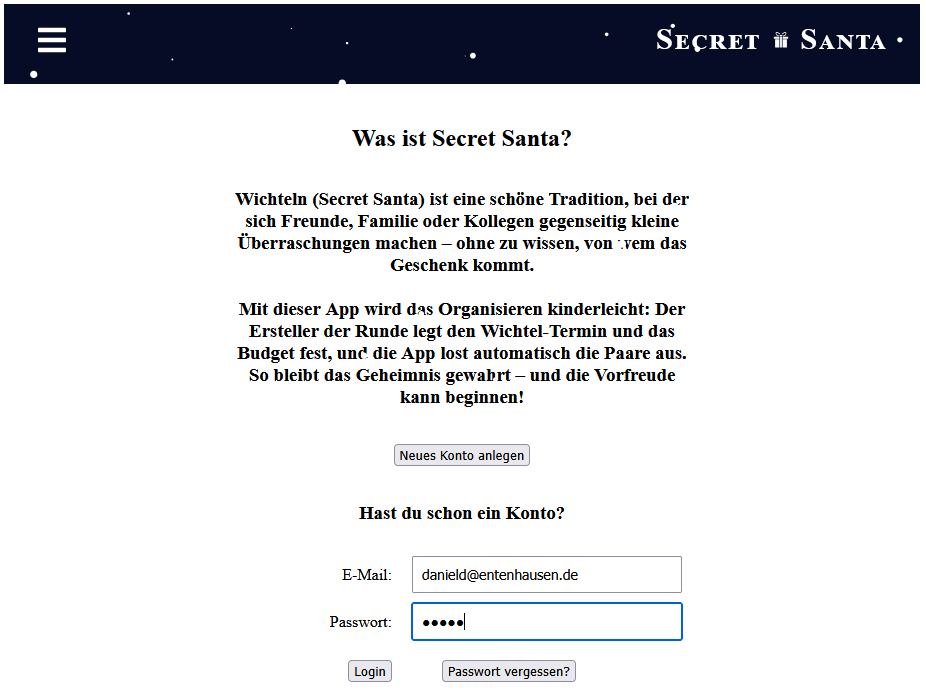
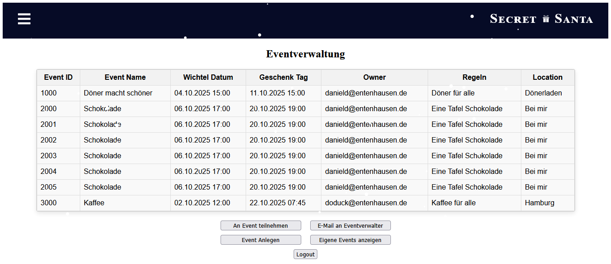
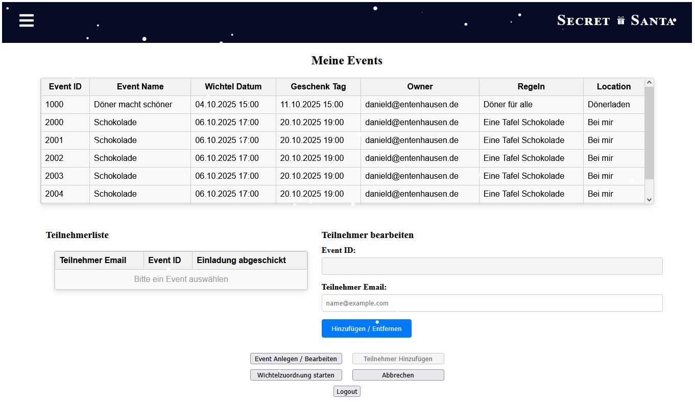
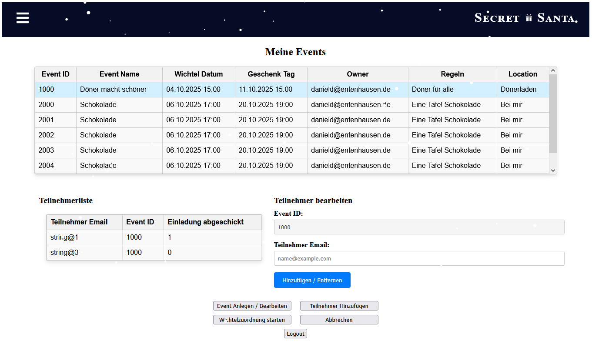

# 🌟🎁 WichtelApp 2

> New version of [WichtelApp](https://github.com/pgs3238/WichtelApp), improving functionality and user experience while completing the original Secret Santa app.

**Last Updated:** 12 November 2025

---
### Landing Screen


---

## 🧭 Motivation

The original WichtelApp was a university group project aimed at creating a functional Secret Santa application. The goal of this continuation is to fix, complete, and improve the app, enhancing functionality and user experience while consolidating lessons learned in full-stack development.

---

## ⚙️ Features

- 🧾 Account Creation
- 🔐 User-Login & Logout
- 🌐 Access to protected areas after login
- 🎉 Event Creation
- ✏️ Event modification
- ➕ Adding users to events
- 📧 Invite users to join the app
- 🔔 Notify users (new or existing) of events they have been invited to
- 🚫🎁 Specify users who cannot give presents to each other
- 🎁 Secret Santa assignment ("Wichteln")
- ❌ Automatic cookie deletion on logout

Passwords are hashed on the frontend before being sent to the backend, which compares them to the stored hashes. Adding salting and stronger security measures is planned for future steps.

---

## 🧰 Technologie-Stack (at the moment)

| Area                 | Technology / Version              |
|:---------------------|:----------------------------------|
| **Backend**          | Quarkus `2.16.6`, Gradle `7.5.1`  |
| **Frontend / Build** | React `18.2.0`, Node.js `18.12.1` |
| **Database**         | PostgreSQL (Docker)               |
| **Language(s)**      | Java `17`, JavaScript             |

**Quarkus extensions used:**
```gradle
    implementation 'io.quarkus:quarkus-hibernate-orm'
    implementation 'io.quarkus:quarkus-hibernate-validator'
    implementation 'io.quarkus:quarkus-resteasy-jsonb'
    implementation 'io.quarkus:quarkus-smallrye-openapi'
    implementation 'io.quarkus:quarkus-resteasy'
    implementation 'io.quarkus:quarkus-security-jpa'
    implementation 'io.quarkus:quarkus-jdbc-postgresql'
    implementation 'io.quarkus:quarkus-arc'
    implementation 'io.quarkus:quarkus-mailer'
    testImplementation 'io.quarkus:quarkus-junit5'
    testImplementation 'io.rest-assured:rest-assured'
```
> 🧪 Test folders (test and native-test) exist but currently contain no implemented tests.

---
## ⚠️ Development Status

### Backend
| Area                    | Status                           |
|:------------------------|:---------------------------------|
| Login                   | implemented                      |
| User management         | implemented                      |
| Event Setup             | implemented                      |
| Secret Santa assignment | theoretically complete, untested |
| Email notification      | planned                          |

### Frontend
| Area                        | Status                                                           |
|:----------------------------|:-----------------------------------------------------------------|
| Landing Page                | implemented and functional                                       |
| Login                       | Integrated into *Landing Page* (⚠️logout sometimes returns here) |
| User creation               | implemented and functional                                       |
| Event creation              | implemented and functional                                       |
| Display events page         | implemented and functional                                       |
| My Events page              | implemented and partially functional                             |
| Display Users in Event Page | Integrated into *My Events Page*                                 |
| Add Users to Event Page     | Integrated into *My Events Page*                                 |
| Group Main Page             | removed                                                          |
| Add/Remove Groups Page      | removed; new function will be added to *My Events Page*          |
| Add Users to Groups Page    | removed; new function will be added to *My Events Page*          |

> ⚠️ Note: Not all buttons are functional. Table entries are test data used for analyzing and debugging.

### Completed / Deprecated
- ~~Implement table in *Display Events* page~~
- ~~Modify layout of *User Creation* page~~
- ~~Implement table in *My Events* page; add scroll function to limit table size to six lines~~
- ~~Implement table from *Display Users in Event* page within *My Events* page; table should populate with data when an event is selected~~
- ~~Implement functionality from *Add Users to Event* page in *My Events* page, to add users to an event;~~ connect frontend with backend and make entry functional 
- ~~Modified backend joined table Event + User: now a joined table with dual key (event, user), and an additional entry indicating whether an email was sent~~
- ~~Modified backend to make the new Event + User table usable in frontend~~
- deprecated joined table Event + User is still active but no longer used
- deprecated *Login* page (+CSS) still active
- deprecated *Display Users in Event* page (+CSS) still active
- deprecated *Add Users to Event* page (+CSS) still active
- deprecated *Group Main* page (+CSS) still active
- deprecated *Add/Remove Groups* page (+CSS) still active
- deprecated *Add Users to Groups* page (+CSS) still active
> ⚠️ Deprecated pages and tables remain in place until replacement features are fully tested and verified to maintain application stability.

### Upcoming / Next Steps

- Add a new function to replace groups.
- Add a backend table for users without accounts (contains email addresses and function replacing groups). When a user creates an account, this data merges with the main User table and the user-event table.
- Test adding users and new function with multiple test users.
- Rewrite Secret Santa function for the new groups replacement and test it.
- Update Quarkus to 3.x and fix broken functionality (email and updated cookie require Quarkus 3.x).
- Add email service: invites sent via email; users must accept in the app. Email is primary key.
- Test all email functionality; possibly add more email features.
- Fix cookie issue.
- Modify taskbar: consider moving link to event creation to top menu and add logout to top menu; remove logout button from bottom or keep both.
- Improve frontend styling.
- Finish the app

### Note to self - Missing in implementation
- Add a “hook” to indicate whether the creator wants to participate in their own event.

### 📸 Current Condition / Screenshots

#### 1. Eventverwaltung

*Shows a table with all events (for testing purposes). In the release version, it will display all events the logged-in user has joined or created.*

#### 2. Meine Events 1

*Displays events created by the user (top table). Selecting an event populates the bottom-left table with participants (if any). Bottom-right allows adding/removing users via email input. Emails will be sent separately once implemented.*

#### 3. Meine Events 2

*Shows participant list and add/remove functionality for a selected event. The “Einladung Abgeschickt” column indicates if an email was sent (1 = sent, 0 = not sent). Future implementation will replace numbers with icons.*

---

## 🛠️ Installation & Setup
Prerequisites:

- Docker installed and running
- PostgreSQL running in a container
- Java 17, Gradle, Node.js installed (or installed via build script)

Steps:
```shell script
#Clone the repository
git clone https://github.com/pgs3238/WichtelApp2.git
cd WichtelApp

# Build project (installs Node, npm dependencies and runs build)
./gradlew build

# Start the application in development mode
./gradlew quarkusDev
```

### 🐳 Database Configuration (Docker)

To run the application locally, a PostgreSQL container must be set up with the following configuration:

| Setting   | Value       |
|:-----------|:------------|
| Host       | `localhost` |
| Port       | `5433`      |
| User       | `quarkus`   |
| Password   | `quarkus`   |
| Database   | `quarkus`   |
| JDBC URL   | `jdbc:postgresql://localhost:5433/quarkus` |

You can start a compatible PostgreSQL container with:

```bash
docker run --name postgres-quarkus \
  -e POSTGRES_USER=quarkus \
  -e POSTGRES_PASSWORD=quarkus \
  -e POSTGRES_DB=quarkus \
  -p 5433:5432 \
  -d postgres:latest
```
---

## 🚀 Usage

1. Start the application
2. Open the landing/login page in your browser
3. Create a user account
4. Log in → cookie will be set
5. Access protected pages
6. View main page (shows all events; planned modification: only show events the user is part of or has created)
7. Click **Eigene Events anzeigen** to display user-created events. 
8. In *My Events* select an event to view participants and add/remove users
9. Logout → cookie will be deleted

---

## ⚠️ Notes

> 🔒 This project is for learning and demonstration purposes only.
Cookie-based storage of user data is not suitable for production environments.

---

## 🧑‍💻 Author & Contact
| Name                | Area                            | Contact                                                                                                                                                                |
|:--------------------|:--------------------------------|:-----------------------------------------------------------------------------------------------------------------------------------------------------------------------|
| Paul-Gerhard Siegel | Backend (User & Login)          | [GitHub](https://github.com/pgs3238) · [LinkedIn](https://www.linkedin.com/in/paul-gerhard-siegel-719a4512/) · [Xing](https://www.xing.com/profile/PaulGerhard_Siegel) |

> ✨ This project is a continuation of the original [WichtelApp](https://github.com/pgs3238/WichtelApp),  
> developed as part of the **IT-Projekt** university course.


