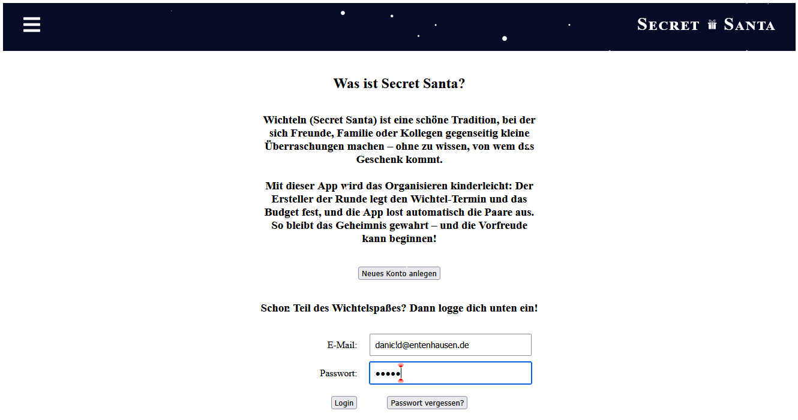
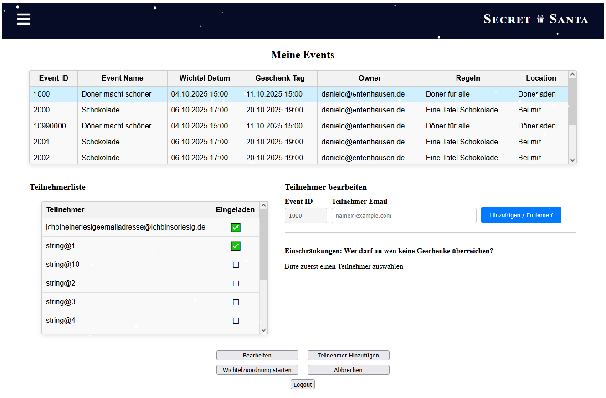

# 🌟🎁 WichtelApp 2

> New version of [WichtelApp](https://github.com/pgs3238/WichtelApp), improving functionality and user experience while completing the original Secret Santa app.

**Last Updated:** 15 November 2025

---
### Landing Screen


---

## 🧭 Motivation

The original WichtelApp was a university group project aimed at creating a functional Secret Santa application. The goal of this continuation is to fix, complete, and improve the app, enhancing functionality and user experience while consolidating lessons learned in full-stack development.

While the original WichtelApp was designed to include multiple navigable pages, this version focuses on two main pages. The primary page displays all events the user has been invited to, as well as those they are administrating. The lower section of this page provides a view of Secret Santa partners for selected events. The second page is dedicated entirely to event administration, offering tools to manage and organize events efficiently.

---

## ⚙️ Features

- 🧾 Account Creation & Login/Logout
- 🎉 Event Creation & Management
- ➕ Adding and inviting users to events
- 🔔 Notifications to users about events
- 🚫🎁 Specify users who cannot give presents to each other
- 🎁 Secret Santa assignment ("Wichteln")

Passwords are hashed on the frontend before being sent to the backend, which compares them to the stored hashes. Adding salting and stronger security measures is planned for future steps.

---

## 🧰 Technologie-Stack

| Area                 | Technology / Version              |
|:---------------------|:----------------------------------|
| **Backend**          | Quarkus `2.16.6`, Gradle `7.5.1`  |
| **Frontend / Build** | React `18.2.0`, Node.js `18.12.1` |
| **Database**         | PostgreSQL (Docker)               |
| **Language(s)**      | Java `17`, JavaScript             |

**Quarkus extensions used:**
```gradle
    implementation 'io.quarkus:quarkus-hibernate-orm'
    implementation 'io.quarkus:quarkus-hibernate-validator'
    implementation 'io.quarkus:quarkus-resteasy-jsonb'
    implementation 'io.quarkus:quarkus-smallrye-openapi'
    implementation 'io.quarkus:quarkus-resteasy'
    implementation 'io.quarkus:quarkus-security-jpa'
    implementation 'io.quarkus:quarkus-jdbc-postgresql'
    implementation 'io.quarkus:quarkus-arc'
    implementation 'io.quarkus:quarkus-mailer'
    testImplementation 'io.quarkus:quarkus-junit5'
    testImplementation 'io.rest-assured:rest-assured'
```
> 🧪 Test folders (test and native-test) exist but currently contain no implemented tests.
> Quarkus extensions used include Hibernate ORM, RESTEasy, Security JPA, OpenAPI, Mailer, and Arc.

---
## ⚠️ Development Status

- Backend & frontend fully functional for core features
- Advanced features like Secret Santa assignment and exclusions are in progress
- Migrating legacy Java EE code to Jakarta EE
- Email notifications and other enhancements planned

---
### 📸 Screenshots

#### 1. Eventverwaltung

*Shows a table with all events (for testing purposes). In the release version, it will display all events the logged-in user has joined or created.*

#### 2. Meine Events

*Demonstrates the development of **Meine Events**. The participant list now shows only email addresses and invitation statuses. The layout has been updated to provide space for a feature that restricts who can be assigned as a Secret Santa, e.g., preventing siblings or family members from giving gifts to each other.*

---

## 🛠️ Installation & Setup
Prerequisites:

- Docker installed and running
- PostgreSQL running in a container
- Java 17, Gradle, Node.js installed (or installed via build script)

Steps:
```shell script
#Clone the repository
git clone https://github.com/pgs3238/WichtelApp2.git
cd WichtelApp

# Build project (installs Node, npm dependencies and runs build)
./gradlew build

# Start the application in development mode
./gradlew quarkusDev
```

### 🐳 Database Configuration (Docker)

To run the application locally, a PostgreSQL container must be set up with the following configuration:

| Setting   | Value                                      |
|:-----------|:-------------------------------------------|
| Host       | `localhost`                                |
| Port       | `5433`                                     |
| User       | `quarkus`                                  |
| Password   | `quarkus`                                  |
| Database   | `quarkus`                                  |
| JDBC URL   | `jdbc:postgresql://localhost:5433/quarkus` |

You can start a compatible PostgreSQL container with:

```bash
docker run --name postgres-quarkus \
  -e POSTGRES_USER=quarkus \
  -e POSTGRES_PASSWORD=quarkus \
  -e POSTGRES_DB=quarkus \
  -p 5433:5432 \
  -d postgres:latest
```
---

## 🚀 Usage

1. Start the application
2. Open the landing/login page in your browser
3. Create a user account
4. Log in → cookie will be set
5. Access protected pages
6. View main page (shows all events; planned modification: only show events the user is part of or has created)
7. Click **Eigene Events anzeigen** to display user-created events. 
8. In *My Events* select an event to view participants and add/remove users
9. Logout → cookie will be deleted

---

## ⚠️ Notes

> 🔒 This project is for learning and demonstration purposes only.
Cookie-based storage of user data is not suitable for production environments.

---

## 🧑‍💻 Author & Contact
| Name                | Area                            | Contact                                                                                                                                                                |
|:--------------------|:--------------------------------|:-----------------------------------------------------------------------------------------------------------------------------------------------------------------------|
| Paul-Gerhard Siegel | Backend (User & Login)          | [GitHub](https://github.com/pgs3238) · [LinkedIn](https://www.linkedin.com/in/paul-gerhard-siegel-719a4512/) · [Xing](https://www.xing.com/profile/PaulGerhard_Siegel) |

> ✨ This project is a continuation of the original [WichtelApp](https://github.com/pgs3238/WichtelApp),  
> developed as part of the **IT-Projekt** university course.


