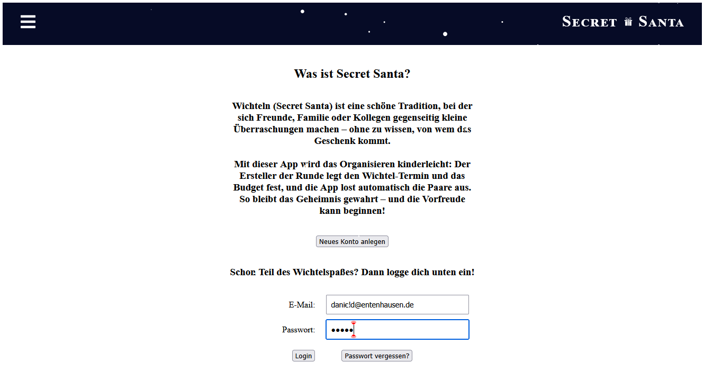
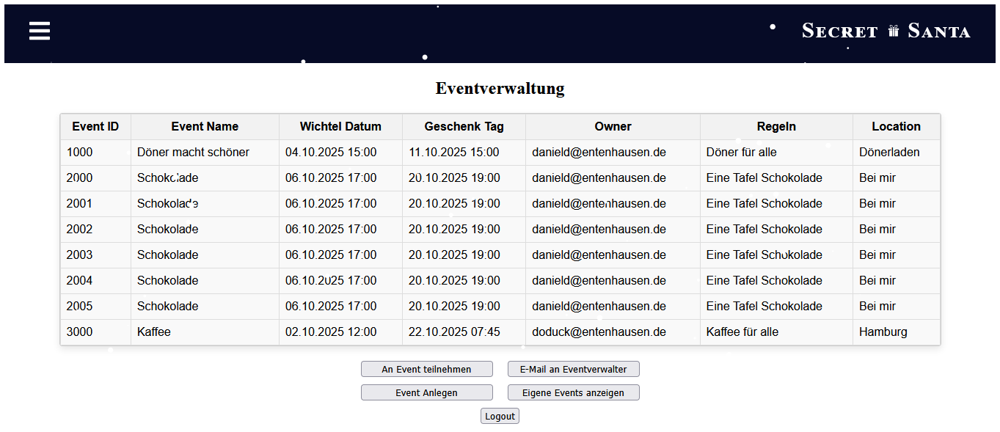
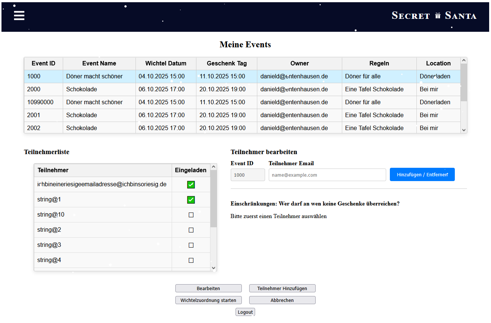

# 🌟🎁 WichtelApp 2

> **WichtelApp2** is a professional evolution of my university project 
[WichtelApp](https://github.com/pgs3238/WichtelApp). This version serves as a sandbox for exploring **modern 
cloud-native Java development**, focusing on the migration from legacy Java EE patterns to **Quarkus** and **Jakarta EE**.

**Status:** Active Refactoring (Nov 2025).

---
### Landing Screen


---

## 🏗️ Architectural Vision

This project is currently undergoing a structural transformation. My goal is to modernize the monolithic structure 
into a more robust, maintainable architecture.

- **RESTful API Evolution:** The application currently utilizes **Java EE REST (JAX-RS)** for its API layer. 
I am actively refactoring these components to align with modern **Jakarta EE** standards and **Quarkus**-native 
features.
- **API Documentation:** Integrated **SmallRye OpenAPI** to provide an interactive Swagger UI, ensuring the API 
contract is fully documented and developer-friendly.
- **Refactoring:** Moving away from legacy Java EE patterns towards a clean **Jakarta EE / Quarkus** ecosystem.
- **Security:** Transitioning from frontend-hashed credentials to a production-grade authentication flow (planned).
- **Frontend Evolution:** Evaluating a migration from standard React to TypeScript to ensure type safety 
across the entire API contract.

---

## 🛠️ Technologie-Stack

| Area                 | Technology / Version                        |
|:---------------------|:--------------------------------------------|
| **Backend**          | Quarkus `2.16.6`, Java `17`, Gradle `7.5.1` |
| **API Layer**        | Java EE, REST (JAX-RS), JSON-B, OpenAPI     |
| **Frontend**         | React `18.2.0`, Node.js `18.12.1`           |
| **Persistence**      | PostgreSQL, Hibernate ORM                   |
| **Containerization** | Docker                                      |

---
## ⚙️ Key Features

- **Identity Management:** Account creation and secure session handling.
- **Event Orchestration:** Create, manage, and invite users to Secret Santa events.
- **Constraint Engine:** Logic to define "no-gift" pairs (e.g., family exclusion rules).
- **Assignment Algorithm:** Core logic for automated Secret Santa pairings.

---

## 🚀 Development Status & Roadmap

* **Authentication & User Management:** Fully operational (Account creation, Login/Logout, Session management).
* **Event Management:** Core infrastructure for event creation and user invitation management is complete.
* **Strategic Pivot:** I have intentionally paused further feature development (specifically SMTP integration and the "Wichteln" algorithm) to prioritize a **migration from Java EE to Jakarta EE**.
    * **Reasoning:** Aligning the codebase with modern Jakarta standards is a prerequisite for seamless integration of new services and ensuring long-term technical stability.
* **Active Sprint:**
    * **Refactoring:** Migrating legacy JAX-RS controllers and dependency injection patterns to Jakarta EE/Quarkus standards.
    * **Upcoming:** Once the migration is stabilized, the SMTP service and the Secret Santa assignment algorithm will be refactored and re-integrated.

---
## 💡 Why this project?

This project demonstrates my ability to:

1. **Manage Tech-Debt:** Identifying where legacy code needs replacement rather than patching.
2. **Enterprise Readiness:** Deep-diving into the Quarkus ecosystem (the industry standard for Kubernetes-native Java).
3. **Full-Stack Thinking:** Bridging the gap between a robust REST backend and a reactive frontend.

---

### 📸 Project Insights

#### 1. Event Management

*Shows a table with all events (for testing purposes). In the release version, it will display all events the logged-in user has joined or created.*

#### 2. Dashboard

*Demonstrates the development of **Meine Events**. The participant list now shows only email addresses and invitation statuses. The layout has been updated to provide space for a feature that restricts who can be assigned as a Secret Santa, e.g., preventing siblings or family members from giving gifts to each other.*

---

## 🛠️ Installation & Setup
Prerequisites:

- Docker installed and running
- PostgreSQL running in a container
- Java 17, Gradle, Node.js installed (or installed via build script)

Steps:
```shell script
#Clone the repository
git clone https://github.com/pgs3238/WichtelApp2.git
cd WichtelApp

# Build project (installs Node, npm dependencies and runs build)
./gradlew build

# Start the application in development mode
./gradlew quarkusDev
```

### 🐳 Database Configuration (Docker)

To run the application locally, a PostgreSQL container must be set up with the following configuration:

| Setting   | Value                                      |
|:-----------|:-------------------------------------------|
| Host       | `localhost`                                |
| Port       | `5433`                                     |
| User       | `quarkus`                                  |
| Password   | `quarkus`                                  |
| Database   | `quarkus`                                  |
| JDBC URL   | `jdbc:postgresql://localhost:5433/quarkus` |

You can start a compatible PostgreSQL container with:

```bash
docker run --name postgres-quarkus \
  -e POSTGRES_USER=quarkus \
  -e POSTGRES_PASSWORD=quarkus \
  -e POSTGRES_DB=quarkus \
  -p 5433:5432 \
  -d postgres:latest
```
---

## 🚀 Usage

1. Start the application
2. Open the landing/login page in your browser
3. Create a user account
4. Log in → cookie will be set
5. Access protected pages
6. View main page (shows all events; planned modification: only show events the user is part of or has created)
7. Click **Eigene Events anzeigen** to display user-created events. 
8. In *My Events* select an event to view participants and add/remove users
9. Logout → cookie will be deleted

---

## 🔗 Contact & Portfolio
| Name                | Area                            | Contact                                                                                                                                                                |
|:--------------------|:--------------------------------|:-----------------------------------------------------------------------------------------------------------------------------------------------------------------------|
| Paul-Gerhard Siegel | Backend (User & Login)          | [GitHub](https://github.com/pgs3238) · [LinkedIn](https://www.linkedin.com/in/paul-gerhard-siegel-719a4512/) · [Xing](https://www.xing.com/profile/PaulGerhard_Siegel) |